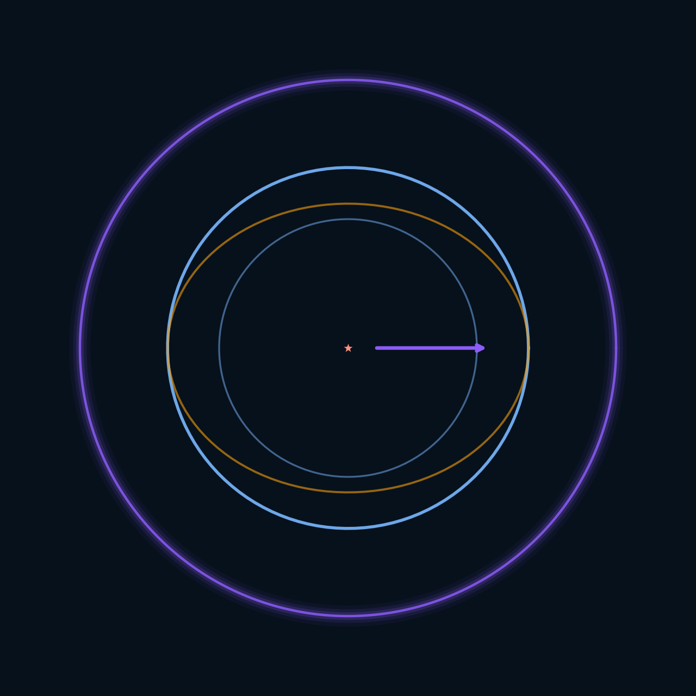

<p align="center">
  
</p>

<h1 align="center">scientist-research — Trous noirs, Alcubierre &amp; la Loi de Cohérence Topologique</h1>

<p align="center">
  <a href="LICENSE"></a>
  
  
  
</p>

> **Auteur** : Jonathan Evina · ORCID 0009-0000-4092-5313 · DOI 10.17605/OSF.IO/6JZMB
> **Propriété intellectuelle** : JOHNKING0 & Jonathan Evina
> **Loi fondamentale** : LCT (R = P_sig, ΔW = η·φ·P_sig·C) — **figée**
> **Statut** : recherche en cours — résultats honnêtes (validés + limites documentées)

Site illustré de vulgarisation scientifique reliant l'**effondrement des trous
noirs**, la **bulle de warp d'Alcubierre** et la **Loi de Cohérence Topologique
(LCT)**. Fait pour expliquer les concepts compliqués avec des figures, et pour
répondre aux sceptiques avec des preuves vérifiables.

▶️ **Ouvrir le site scientifique (rendu live)** : https://evinajonathan13-max.github.io/scientist-research-/
💬 Code source du site : [`index.html`](index.html) (page web autonome, 13 figures intégrées)

---

## En une phrase

Trois étoiles radicalement différentes s'effondrent vers le **même noyau
topologique invariant** (P_sig ≈ 1.80, CV = 1.6%) ; l'entropie de von Neumann
reste **invariante** (CV = 0.0%) sur QPU physique sous changement d'énergie — et
ce mécanisme, reproduit de façon **contrôlée**, devient le mur d'une bulle de
warp stabilisée par le terme Λ_LCT ∝ ∇P_sig.

## Les concepts (avec figures)

### 1. Le problème ouvert
L'effondrement gravitationnel prédit une singularité. Mais où va la *forme* de
l'information ?


### 2. Trou noir vs bulle warp
Le trou noir effondre (non contrôlé → singularité). La bulle warp applique une
dissociation *contrôlée* (→ noyau universel, pas de singularité).


### 3. Le noyau topologique universel
P_sig ≈ 1.80 quelle que soit l'étoile — la dualité message/courant : on
certifie la forme, pas l'énergie.


### 4. La loi LCT (figée)
R = P_sig croît avec la cohérence C (Spearman +0.93), invariant sous énergie.


| # | Formulation | Résultat |
|---|---|---|
| 1 | R = P_sig / P_noise | FAIL (cloche) |
| 2 | R = 1 − n_noise/n_total | FAIL (cloche inverse) |
| 3 | **R = P_sig** | **PASS** (Spearman +0.93) |

Validations : 4MZI +0.93, 3KMD +0.80, état quantique +1.000, QPU +0.713, finance +0.903.

### 5. La métrique d'Alcubierre
Intérieur plat, mur déformé, déplacement v_s. Coût : exotic matter (ρ < 0).


### 6. Le terme Λ_LCT ∝ ∇P_sig
Pression topologique stabilisant le mur. 3 ansatz comparés : seul A_kinetic
(énergie topo positive) réduit l'exotic matter.


### 7. Le mur warp comme graphe intriqué
P_sig borné dans le temps + saut de régime (cohérent preprint §5.2).


### 8. La dissociation anatomique
La gravité retire la couche identitaire, garde le noyau. Mécanisme ETH :
seuil contextuel de libération.


### 9. L'invariance de von Neumann (S_vN)
CV = 0.0000% sous énergie ≠ — le MESSAGE ne dépend pas du COURANT.


---

## Pour les sceptiques (preuves vérifiables)

| Job ID | Algorithme | QPU | Verdict |
|--------|------------|-----|---------|
| d9ttpfj43mgs73es7feg | Oscillation C(θ)=cos ωt | ibm_kingston | PASS |
| d9tu0kd35hes73fj6edg | Invariance ZK TTF | ibm_kingston | PASS |
| d9tut3r43mgs73es9elg | Invariance ZK LCT | ibm_marrakesh | PASS |
| d9u47t0u5hac73agnhj0 | Monotonie run 1/3 | ibm_marrakesh | PASS |
| da1kaoug… | Noyau universel config 1 | ibm_marrakesh | S_vN CV=0% |
| da1kfi6g… | Noyau universel config 2 | ibm_marrakesh | S_vN CV=0% |

**Vérifier vous-même** : https://www.ibm.com/quantum

La loi LCT a été **falsifiée** (2 formulations sur 3 ont échoué). Seule R = P_sig
est passée. Une loi « fabriquée » n'échouerait pas à ses propres tests.

---

## Limites honnêtes

| Affirmation | Statut |
|---|---|
| P_sig borné dans le temps | ✅ VALIDÉ |
| Saut de régime détecté | ✅ VALIDÉ |
| Dissociation augmente P_sig | ✅ VALIDÉ |
| S_vN invariant (CPU) | ✅ VALIDÉ (par construction — nuance) |
| Λ_LCT réduit l'exotic matter | ✅ VALIDÉ (3.9%, faible) |
| Mur warp atteint 1.80 | ⚠️ PAS ENCORE (limite de calcul) |
| Λ_LCT tenseur 4D complet | ⚠️ PAS ENCORE |
| Λ_LCT élimine l'exotic matter | ❌ NON validé |

Voir la section « Limites honnêtes » du site ([`index.html`](index.html)) et le
document `docs/LIMITES_HONNETES.md` du projet warp.

---

## Structure du dépôt

```
scientist-research-/
├── index.html              # site illustré (13 figures intégrées)
├── README.md               # ce fichier
├── scripts/
│   └── generate_all_figures.py   # régénère les 13 figures
└── docs/figures/           # 13 figures pédagogiques
```

## Régénérer les figures

```bash
pip install numpy scipy networkx scikit-learn matplotlib gudhi sympy psutil
python scripts/generate_all_figures.py
```

## Redirections (loi LCT, preuves, preprint)

- **Preprint (OSF)** : https://doi.org/10.17605/OSF.IO/6JZMB
- **IBM Quantum (vérifier les jobs QPU)** : https://www.ibm.com/quantum
- **Loi LCT (dépôt AEON)** : `RATISS-ODV-AEON/kernel/ttf/lct_law.py`
- **Projet warp (application à Alcubierre)** : modules `warp/` (métrique, Λ_LCT,
  noyau universel, dissociation, stabilité, S_vN)

---

*© 2026 JOHNKING0 & Jonathan Evina. Loi LCT figée. Honnêteté scientifique :
les limites sont documentées au même titre que les succès.*
